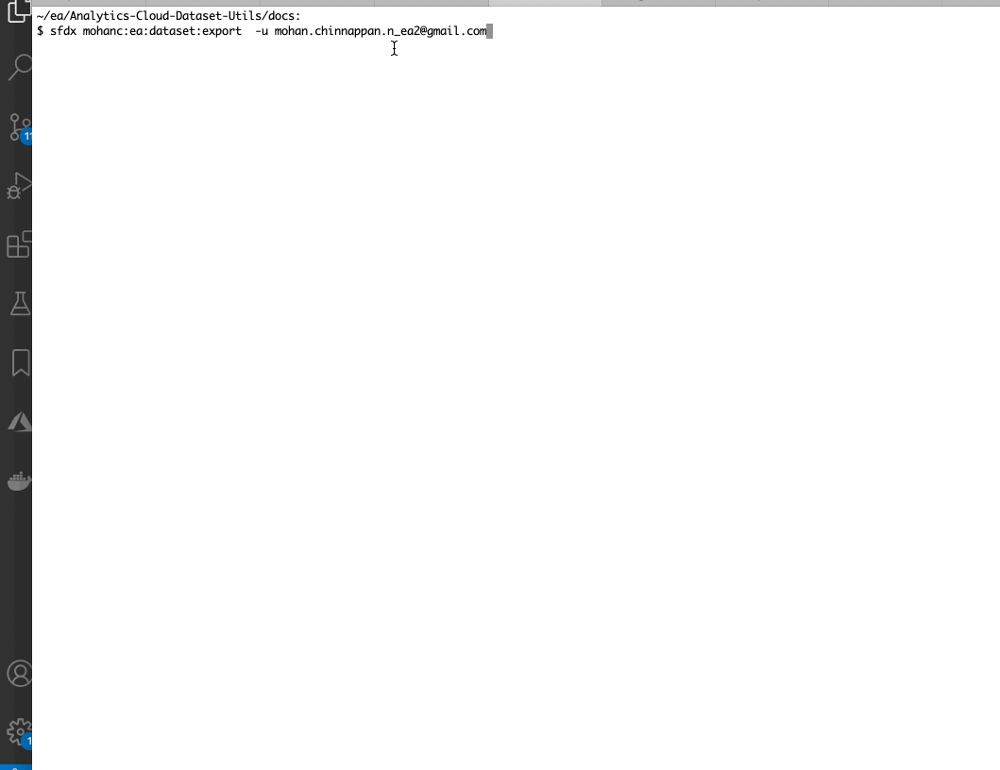

## Export data via Export transformation


### Permissions required


### Export via edgeMart  Dataflow
- Run the following Dataflow 

``` json 

{

  "getMyCustomer": {
    "action": "edgemart",
    "parameters": {
      "alias": "mycustomers"
    }
  },


  "exportMyCustomers": {
    "action": "export",
    "parameters": {
      "source": "getMyCustomer",
      "userId": "0053h000002xQ5sAAE",
      "target": "EinsteinDiscovery"
    }
  }
}


```


<a name='#singlecmd'>Single Command Option</a>

### DX query to get DatasetExport Id, DatasetExportPart Id, Access Token

```

sfdx force:data:soql:query -u mohan.chinnappan.n_ea2@gmail.com -q " SELECT CreatedById,CreatedDate,Id,LastModifiedById,LastModifiedDate,Owner,Status FROM DatasetExport ORDER BY LastModifiedDate DESC"
CREATEDBYID         CREATEDDATE                   ID                  LASTMODIFIEDBYID    LASTMODIFIEDDATE              OWNER               STATUS
──────────────────  ────────────────────────────  ──────────────────  ──────────────────  ────────────────────────────  ──────────────────  ─────────
0053h000003de6bAAA  2020-07-15T21:34:59.000+0000  0Px3h0000004D6ECAU  0053h000003de6bAAA  2020-07-15T21:35:10.000+0000  0053h000002xQ5sAAE  Completed
0053h000003de6bAAA  2020-07-15T20:57:06.000+0000  0Px3h0000004D64CAE  0053h000003de6bAAA  2020-07-15T20:57:17.000+0000  0053h000002xQ5sAAE  Completed
Total number of records retrieved: 2.

### let us get the part details for  the latest DatasetExportPart 
$ sfdx force:data:soql:query -u mohan.chinnappan.n_ea2@gmail.com -q " SELECT Id,PartNumber, DataFileLength,DatasetExportId FROM DatasetExportPart WHERE DatasetExportId='0Px3h0000004D6ECAU'"
ID                  PARTNUMBER  DATAFILELENGTH  DATASETEXPORTID
──────────────────  ──────────  ──────────────  ──────────────────
0Py3h0000004DlHCAU  1           96240           0Px3h0000004D6ECAU


### Get Access token
$ sfdx mohanc:hello:org -u mohan.chinnappan.n_ea2@gmail.com 
accessToken:00D3h000007R1Lu!AR0AQJVVkhIy2Blockedsv.m0CGmoXsX9ctgUw4o6zFS5JORWE5oeyQUUE5xRUHFt3RSjDSZ2O4SheisV1rQdjswwZgVtCZ_V32qeB
*** RESULTS: {
....

```

### Getting the CSV file for the partnumber 1 via CURL
```
$ curl -X GET    https://mohansun-ea-02-dev-ed.my.salesforce.com/services/data/v48.0/sobjects/DatasetExportPart/0Py3h0000004DlHCAU/DataFile  -H 'Authorization: Bearer 00D3h000007R1Lu!AR0AQJVVkhIy2BLOCKEDsv.m0CGmoXsX9ctgUw4o6zFS5JORWE5oeyQUUE5xRUHFt3RSjDSZ2O4SheisV1rQdjswwZgVtCZ_V32qeB'

"2437 Shannon Kim","2016-06-17",71,68881,5810
"5190 Joan Greene","1942-01-04",71,63160,2063
"1588 Angela Ramos","1912-10-01",71,36867,2243
"6608 Sonia Thomas","1944-01-22",71,21154,3606
"1571 Mary Castillo","1989-07-02",71,39828,4597
"114 Heather Moore","2015-05-14",71,1261,3851
"4717 Thomas White","1916-07-28",71,63115,5566
"2034 Edwin Mcconnell","1931-02-15",71,25677,3264
"9718 Lori White","1956-08-04",71,2354,9807
"5529 Tonya Barnes","1932-08-30",71,92786,689
"6467 Laura Adams","2000-03-20",71,52176,2407
"7628 Alexandra Rush","2017-06-26",71,75562,2218
...


```
<a href='singlecmd'></a>
## Single command to export a Dataset into CSV? 

- Run this after your dataflow run is completed
- This will fetch the latest run to get the csv file
```
$ sfdx mohanc:ea:dataset:export  -h
Dataset Exporter  

USAGE
  $ sfdx mohanc:ea:dataset:export

OPTIONS
  -u, --targetusername=targetusername             username or alias for the target org; overrides default target org
  --apiversion=apiversion                         override the api version used for api requests made by this command
  --json                                          format output as json
  --loglevel=(trace|debug|info|warn|error|fatal)  logging level for this command invocation

EXAMPLE

              exports the lastest run datasetExport into a csv file

```

### Demo
```
$ sfdx mohanc:ea:dataset:export  -u mohan.chinnappan.n_ea2@gmail.com
name,dob,seq,amt1,amt2
"8945 Mrs. Pam Cordova","2003-05-15",71,19408,2120
"897 Larry Foster","1937-06-08",71,85612,8351
"2943 Nancy Chung","1915-07-20",71,18120,3658
"9817 Jeffrey Shields","1943-12-30",71,93725,3520
"176 Kimberly Lawson","1970-08-30",71,40014,7528
"1842 Joseph Simmons","1956-01-21",71,86296,5866
"286 Shane Bradley","1905-12-12",71,19681,4316
"6419 Brittany Dyer","1954-10-04",71,95849,422
"1167 Kelsey Haas","1916-04-26",71,11745,8665
....
```




## Extra info
### How to query list of dataflows using dx

```
$ sfdx mohanc:ea:query  -u mohan.chinnappan.n_ea2@gmail.com -r dataflows
```

```json
{
  "dataflows": [
    {
      "createdBy": {
        "id": "0053h000002xQ5sAAE",
        "name": "Mohan Chinnappan",
        "profilePhotoUrl": "/img/userprofile/default_profile_45_v2.png"
      },
      "createdDate": "2020-07-15T21:31:52.000Z",
      "description": "exportOppty2",
      "emailNotificationLevel": "warnings",
      "historiesUrl": "/services/data/v48.0/wave/dataflows/02K3h000000Mu1oEAC/histories",
      "id": "02K3h000000Mu1oEAC",
      "label": "exportOppty2",
      "lastModifiedBy": {
        "id": "0053h000002xQ5sAAE",
        "name": "Mohan Chinnappan",
        "profilePhotoUrl": "/img/userprofile/default_profile_45_v2.png"
      },
      "lastModifiedDate": "2020-07-15T21:33:27.000Z",
      "name": "exportOppty2",
      "type": "dataflow",
      "url": "/services/data/v48.0/wave/dataflows/02K3h000000Mu1oEAC"
    },
    {
      "createdBy": {
        "id": "0053h000002xQ5sAAE",
        "name": "Mohan Chinnappan",
        "profilePhotoUrl": "/img/userprofile/default_profile_45_v2.png"
      },
      "createdDate": "2020-07-15T20:55:04.000Z",
      "description": "exportOppty",
      "emailNotificationLevel": "warnings",
      "historiesUrl": "/services/data/v48.0/wave/dataflows/02K3h000000Mu0vEAC/histories",
      "id": "02K3h000000Mu0vEAC",
      "label": "exportOppty",
      "lastModifiedBy": {
        "id": "0053h000002xQ5sAAE",
        "name": "Mohan Chinnappan",
        "profilePhotoUrl": "/img/userprofile/default_profile_45_v2.png"
      },
      "lastModifiedDate": "2020-07-15T20:56:08.000Z",
      "name": "exportOppty",
      "type": "dataflow",
      "url": "/services/data/v48.0/wave/dataflows/02K3h000000Mu0vEAC"
    },
    {
      "createdBy": {
        "id": "0053h000002xQ5sAAE",
        "name": "Mohan Chinnappan",
        "profilePhotoUrl": "/img/userprofile/default_profile_45_v2.png"
      },
      "createdDate": "2020-07-15T18:33:46.000Z",
      "description": "ExportCustomers",
      "emailNotificationLevel": "warnings",
      "historiesUrl": "/services/data/v48.0/wave/dataflows/02K3h000000MtyuEAC/histories",
      "id": "02K3h000000MtyuEAC",
      "label": "ExportCustomers",
      "lastModifiedBy": {
        "id": "0053h000002xQ5sAAE",
        "name": "Mohan Chinnappan",
        "profilePhotoUrl": "/img/userprofile/default_profile_45_v2.png"
      },
      "lastModifiedDate": "2020-07-15T18:33:46.000Z",
      "name": "ExportCustomers",
      "type": "dataflow",
      "url": "/services/data/v48.0/wave/dataflows/02K3h000000MtyuEAC"
    },
    {
      "createdBy": {
        "id": "0053h000002xQ5sAAE",
        "name": "Mohan Chinnappan",
        "profilePhotoUrl": "/img/userprofile/default_profile_45_v2.png"
      },
      "createdDate": "2020-07-14T10:54:45.000Z",
      "description": "fruitsdf",
      "emailNotificationLevel": "warnings",
      "historiesUrl": "/services/data/v48.0/wave/dataflows/02K3h000000MrxWEAS/histories",
      "id": "02K3h000000MrxWEAS",
      "label": "fruitsdf",
      "lastModifiedBy": {
        "id": "0053h000002xQ5sAAE",
        "name": "Mohan Chinnappan",
        "profilePhotoUrl": "/img/userprofile/default_profile_45_v2.png"
      },
      "lastModifiedDate": "2020-07-14T11:00:13.000Z",
      "name": "fruitsdf",
      "type": "dataflow",
      "url": "/services/data/v48.0/wave/dataflows/02K3h000000MrxWEAS"
    },
    {
      "createdBy": {
        "id": "0053h000002xQ5sAAE",
        "name": "Mohan Chinnappan",
        "profilePhotoUrl": "/img/userprofile/default_profile_45_v2.png"
      },
      "createdDate": "2020-07-13T19:30:57.000Z",
      "description": "The_Motivator",
      "emailNotificationLevel": "warnings",
      "historiesUrl": "/services/data/v48.0/wave/dataflows/02K3h000000Mr7JEAS/histories",
      "id": "02K3h000000Mr7JEAS",
      "label": "The_Motivator",
      "lastModifiedBy": {
        "id": "0053h000002xQ5sAAE",
        "name": "Mohan Chinnappan",
        "profilePhotoUrl": "/img/userprofile/default_profile_45_v2.png"
      },
      "lastModifiedDate": "2020-07-13T19:30:57.000Z",
      "name": "The_Motivator",
      "type": "dataflow",
      "url": "/services/data/v48.0/wave/dataflows/02K3h000000Mr7JEAS"
    },
    {
      "createdBy": {
        "id": "0053h000003de6bAAA",
        "name": "Integration User",
        "profilePhotoUrl": "/img/userprofile/default_profile_45_v2.png"
      },
      "createdDate": "2020-07-13T19:30:57.000Z",
      "description": "This is the default Salesforce dataflow.",
      "emailNotificationLevel": "failures",
      "historiesUrl": "/services/data/v48.0/wave/dataflows/02K3h000000Mr7KEAS/histories",
      "id": "02K3h000000Mr7KEAS",
      "label": "Default Salesforce Dataflow",
      "lastModifiedBy": {
        "id": "0053h000003de6bAAA",
        "name": "Integration User",
        "profilePhotoUrl": "/img/userprofile/default_profile_45_v2.png"
      },
      "lastModifiedDate": "2020-07-13T19:30:57.000Z",
      "name": "SalesEdgeEltWorkflow",
      "type": "dataflow",
      "url": "/services/data/v48.0/wave/dataflows/02K3h000000Mr7KEAS"
    }
  ]
}
```
### Usage info for ea:query


```
$ sfdx mohanc:ea:query  -h
Query a EA

USAGE
  $ sfdx mohanc:ea:query

OPTIONS
  -l, --loginfilename=loginfilename                Name of file containing login credentials
  -o, --orgname=orgname                            Org name in the Login File

  -r, --resource=resource                          EA resource : 
                                                   dashboards|dataConnectors|dataConnectorsTypes|dataflowJobs|datasets|folders|lense
                                                   s|recipes|templates|trendedreports

  -u, --targetusername=targetusername              username or alias for the target org; overrides default target org

  -v, --targetdevhubusername=targetdevhubusername  username or alias for the dev hub org; overrides default dev hub org

  --apiversion=apiversion                          override the api version used for api requests made by this command

  --json                                           format output as json

  --loglevel=(trace|debug|info|warn|error|fatal)   logging level for this command invocation

EXAMPLE
 
         sfdx force:auth:web:login -r https://login.salesforce.com
         $ sfdx force:org:list
         === Orgs
        ALIAS     USERNAME                            ORG ID              CONNECTED STATUS
                  mohan.chinnappan.n_ea@gmail.com     00D1N000001Tjk2UAC  Connected

         sfdx mohanc:ea:query  -u  mohan.chinnappan.n_ea@gmail.com    -r dashboards > dashboards.json

         resources:
         1. dashboards
         2. dataConnectorTypes
         3. dataConnectors
         4. dataflowjobs
         5. folders
         6. lenses
         7. query
         8. recipes
         9. templates
         10. trendedreports
```
