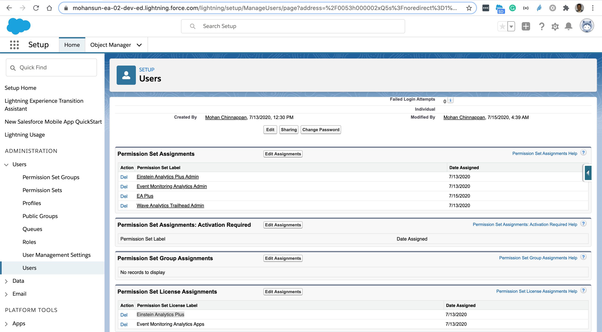
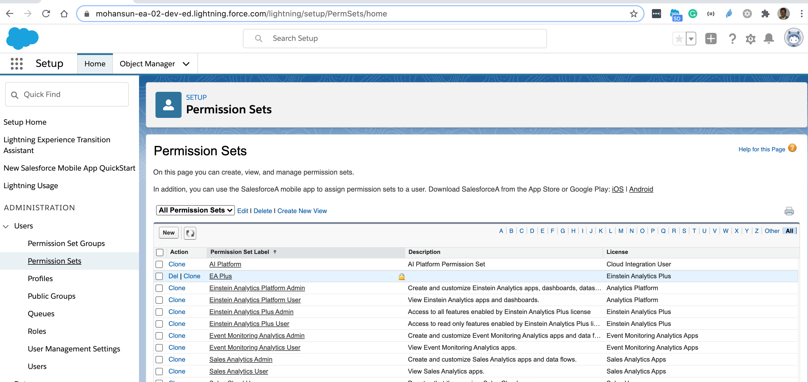

## Export data via Export transformation

### Permissions required





### Export via edgeMart  Dataflow
- Run the following Dataflow 

``` json 

{

  "getMyCustomer": {
    "action": "edgemart",
    "parameters": {
      "alias": "mycustomers"
    }
  },


  "exportMyCustomers": {
    "action": "export",
    "parameters": {
      "source": "getMyCustomer",
      "userId": "0053h000002xQ5sAAE",
      "target": "EinsteinDiscovery"
    }
  }
}


```


### DX query to get DatasetExport Id, DatasetExportPart Id, Access Token

```
$ sfdx force:data:soql:query -u mohan.chinnappan.n_ea2@gmail.com -q " SELECT CreatedById,CreatedDate,Id,LastModifiedById,LastModifiedDate,Owner,Status FROM DatasetExport"
CREATEDBYID         CREATEDDATE                   ID                  LASTMODIFIEDBYID    LASTMODIFIEDDATE              OWNER               STATUS
──────────────────  ────────────────────────────  ──────────────────  ──────────────────  ────────────────────────────  ──────────────────  ─────────
0053h000003de6bAAA  2020-07-15T20:57:06.000+0000  0Px3h0000004D64CAE  0053h000003de6bAAA  2020-07-15T20:57:17.000+0000  0053h000002xQ5sAAE  Completed
0053h000003de6bAAA  2020-07-15T21:34:59.000+0000  0Px3h0000004D6ECAU  0053h000003de6bAAA  2020-07-15T21:35:10.000+0000  0053h000002xQ5sAAE  Completed
Total number of records retrieved: 2.

$ sfdx force:data:soql:query -u mohan.chinnappan.n_ea2@gmail.com -q " SELECT Id,PartNumber, DataFileLength,DatasetExportId FROM DatasetExportPart WHERE DatasetExportId='0Px3h0000004D6ECAU'"
ID                  PARTNUMBER  DATAFILELENGTH  DATASETEXPORTID
──────────────────  ──────────  ──────────────  ──────────────────
0Py3h0000004DlHCAU  1           96240           0Px3h0000004D6ECAU


### Get Access token
$ sfdx mohanc:hello:org -u mohan.chinnappan.n_ea2@gmail.com 
accessToken:00D3h000007R1Lu!AR0AQJVVkhIy2Blockedsv.m0CGmoXsX9ctgUw4o6zFS5JORWE5oeyQUUE5xRUHFt3RSjDSZ2O4SheisV1rQdjswwZgVtCZ_V32qeB
*** RESULTS: {
....

```

### Getting the CSV file via CURL
```
$ curl -X GET    https://mohansun-ea-02-dev-ed.my.salesforce.com/services/data/v48.0/sobjects/DatasetExportPart/0Py3h0000004DlHCAU/DataFile  -H 'Authorization: Bearer 00D3h000007R1Lu!AR0AQJVVkhIy2BLOCKEDsv.m0CGmoXsX9ctgUw4o6zFS5JORWE5oeyQUUE5xRUHFt3RSjDSZ2O4SheisV1rQdjswwZgVtCZ_V32qeB'

"2437 Shannon Kim","2016-06-17",71,68881,5810
"5190 Joan Greene","1942-01-04",71,63160,2063
"1588 Angela Ramos","1912-10-01",71,36867,2243
"6608 Sonia Thomas","1944-01-22",71,21154,3606
"1571 Mary Castillo","1989-07-02",71,39828,4597
"114 Heather Moore","2015-05-14",71,1261,3851
"4717 Thomas White","1916-07-28",71,63115,5566
"2034 Edwin Mcconnell","1931-02-15",71,25677,3264
"9718 Lori White","1956-08-04",71,2354,9807
"5529 Tonya Barnes","1932-08-30",71,92786,689
"6467 Laura Adams","2000-03-20",71,52176,2407
"7628 Alexandra Rush","2017-06-26",71,75562,2218
...


```

## Notes - Future work
- All these DX separate operations will be made available by this command in future

``` 
sfdx mohanc:ea:dataset:export -e  0Px3h0000004D6ECAU

```
- Above command will emit the csv files part by part
