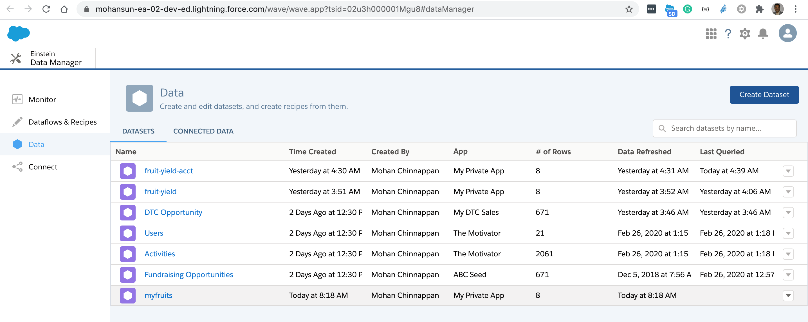
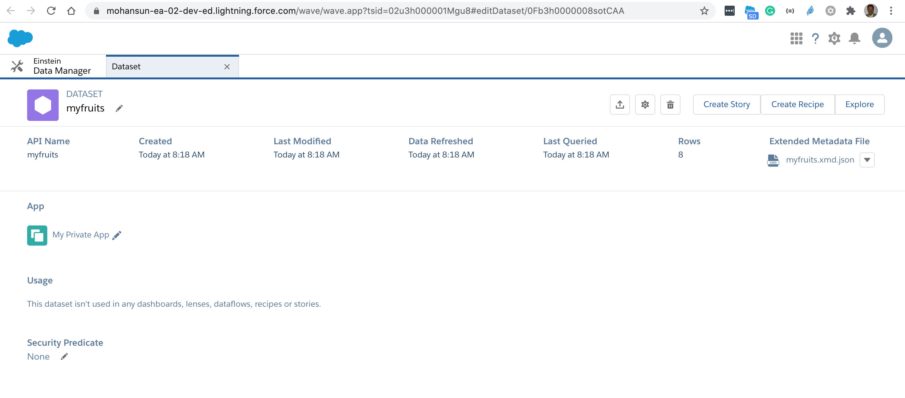

## How to load a csv file into a dataset

### Commmand
```bash
java -jar datasetutils-48.1.0.jar --server false --action load --u $un --p $pw$st --inputFile data/fruits.csv --dataset myfruits

```

### Console log for loading a csv file fruits.csv into dataset myfruits
```


		**************************************************
		Salesforce Analytics Cloud Dataset Utils - 48.1.0
		**************************************************


*******************************************************************************
java.version:11.0.4
java.class.path:datasetutils-48.1.0.jar
*******************************************************************************


DatsetUtils called with {12} Params:
{--server}:{false}
{--action}:{load}
{--u}:{mohan.chinnappan.n_ea2@gmail.com}
{--p}:{*******}
{--inputFile}:{data/fruits.csv}
{--dataset}:{myfruits}


Logging in ...
Service Endpoint: https://mohansun-ea-02-dev-ed.my.salesforce.com/services/Soap/u/48.0/00D3h000007R1Lu


*******************************************************************************
File {data/fruits.csv} has Charset {ISO-8859-2}, Confidence: {33%}
*******************************************************************************


*******************************************************************************
Start Timestamp: 07/15/2020 15:18:09.421 GMT
inputFileString: data/fruits.csv
schemaFileString: null
inputFileCharset: ISO-8859-2
datasetAlias: myfruits
datasetLabel: myfruits
datasetFolder: null
Operation: Overwrite
uploadFormat: binary
notificationLevel: null
notificationEmail: null
JVM Max memory: 4,096
JVM Total memory: 256
JVM Free memory: 238
*******************************************************************************


*******************************************************************************
Detecting schema from csv file {data/fruits.csv} ...
Column: fruit, Type: Text, Precison: 9
Column: date, Type: Date, Format: MM/dd/yyyy
Column: qty, Type: Numeric, Scale: 0 Format: n/a
Schema file {data/fruits_schema.json} successfully generated...

*******************************************************************************

Record {06V3h000000D4gkEAC} Inserted into InsightsExternalData, upload time {1,052} msec

*******************************************************************************
File: fruits.csv, being digested to file: 06V3h000000D4gkEAC.fruits.gz
*******************************************************************************

Start: Writer-Thread
Waiting for writer to finish
Processing row {1} time {0}
Processed last row {8} time {7}
END: Writer-Thread

*******************************************************************************
Total Rows: 8, Success Rows: 8, Error Rows: 0, % Compression: 0%, Digest Time {1,018} msecs
*******************************************************************************


*******************************************************************************
Uploading dataset {myfruits} to folder {0053h000002xQ5sAAE}
*******************************************************************************

Start: FilePartsUploaderThread-1
File Part {data/archive/myfruits/06V3h000000D4gkEAC.fruits.1.gz} Inserted into InsightsExternalDataPart: 06W3h000000DcYaEAK, upload time {238} msec
END: FilePartsUploaderThread-1
FilePartsUploaderThread-1 is done
Record {06V3h000000D4gkEAC} updated in InsightsExternalData, upload time {1,118} msec

*****************************************************************************************************************
Successfully uploaded {data/fruits.csv} to Dataset {myfruits} uploadTime {3,713} msecs
*****************************************************************************************************************


*******************************************************************************
End Timestamp: 07/15/2020 15:18:17.538 GMT
JVM Max memory: 4,096
JVM Total memory: 256
JVM Free memory: 156
*******************************************************************************
```


### Results



